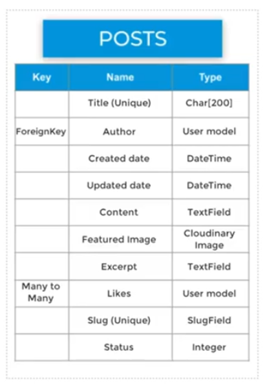
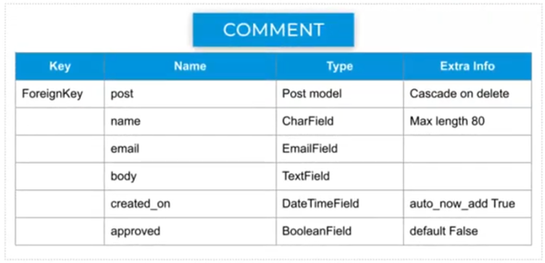

# Django Blog

## Starting a new project
1. Within the newly generated repository, click on projects on the bar at the top
2. Click on 'New Project', give it a sensible name and select 'Basic Kanban' from templates
3. Remove the pre-generated notes from the left had side of the new project board
4. Check there are 3 collums (To do, In progress and Complete - or any other sensible names)

To move "new issues" into  the to-do column when they're newly added:
1. Click on the three dots in the top right corner of the to-do column
2. Click on 'manage automation' from the drop down list, click on the 'newly added' checkbox
3. Click on 'Update automation'.

Setting up a User Story Template on GitHub:
1. In the settings tab at the top of the page, scroll down to 'Features' and click on 'Set up template'
2. Click on the drop down list and select 'custom template', then click 'preview and edit'
3. Template name: User Story, About: This is our default user story template, Template Content: As a **role** I can **capability** so that **received benefit**, Issue default title: USER STORY: <title>
4. Click on the 'X' in the top right corner of this field, and then click on 'Propose Changes'
5. Write a suitable commit message such as 'Add a new user story temple' and commit the changes

To use the new template:
1. Click on 'Issues' at the top of the page and select 'New Issue', then click 'get started' on the template you just created
2. Add user stories to the template:
    <ol>
        <li>View post list: As a Site User I can view a list of posts so that I can select one to read</li>
        <li>Open a post: As a Site User I can click on a post so that I can read the full text</li>
        <li>View likes: As a Site User / Admin I can view the number of likes on each post so that I can see which is the most popular or viral</li>
        <li>View comments: As a Site User / Admin I can view comments on an individual post so that I can read the conversation</li>
        <li>Account registration: As a Site User I can register an account so that I can comment and like</li>
        <li>Comment on a post: As a Site User I can leave comments on a post so that I can be involved in the conversation</li>
        <li>Like / Unlike: As a Site User I can like or unlike a post so that I can interact with the content</li>
        <li>Manage posts: As a Site Admin I can create, read, update and delete posts so that I can manage my blog content</li>
        <li>Create drafts: As a Site Admin I can create draft posts so that I can finish writing the content later</li>
        <li>Approve comments: As a Site Admin I can approve or disapprove comments so that I can filter out objectionable comments</li>
    </ol>
3. When the title and main body have been filled, click on 'Projects' on the right hand side and select the prjoct to link the issue to.

## New Project Checklist
1. Install Django and the supporting libraries
2. Create a new blank django project and app
3. Set our project to use PostgreSQL and Clouinary
4. Deploy our new empty projct to Heroku

### Install Django and the supporting libraries
> pip3 install django gunicorn 
> pip3 install dj_database_url psycopg2 
> pip3 install dj3-cloudinary-storage 
> pip3 freeze --local > requirements.txt 

### Create a new blank django project and app
> django-admin startproject {project_name} . 
> python3 manage.py startapp blog

Now we need to add the newly created 'blog' app to the list of installed apps in settings.py
1. Navigate to settings.py
2. At the end of the INSTALLED_APPS list, add "'blog',"
3. Make migrations:
> python3 manage.py migrate

### Set up project to use PostgreSQL and Clouinary

<strong>NOTE: If you get the error below during the steps to deployment:</strong>
django.db.utils.OperationalError: FATAL: role "somerandomletters" does not exist 
Run the following command in the terminal to fix it: "unset PGHOSTADDR"

<strong>PostgreSQL</strong>

1. Create a new app on Heroku
2. In the resources tab, search for Postgres in the add-ons box
3. Click on the settings tab and reveal config vars, copy the value of DATABASE_URL
4. At the same level as requirements.txt create a file called 'env.py'
5. Within the env.py, import os, and set up the DATABASE_URL and SECRET_KEY variables to match those in Heroku (generate a secret key from https://miniwebtool.com/django-secret-key-generator/)
6. In settings.py, import os, import dj_database_url, and set an if statement to retrieve the env.py file 
7. Remove the string in the SECRET_KEY variable and replace with os.environ.get('SECRET_KEY')
8. Comment out the DATABASES section in settings.py
9. Make mirgrations: python3 manage.py migrate

<strong>Cloudinary</strong>

1. Log in/Sign up to cloudinary and navigate to the dashboard
2. Copy the API Environment Variable key to the clipbaord
3. Make a new environ in env.py and copy in the URL (removing "CLOUDINARY_URL =" from the beginning)
4. Paste the URL into the Heroku config vars as well
5. In the Heroku config vars add: DISABLE_COLLECTSTATIC and set the value to '1'
6. In the INSTALLED_APPS section above the static files string, add "cloudinary_storage" and above blog, add "cloudinary"
7. Towards the bottom of settings.py in the static files section, add the following:
    <ol>
        <li>STATICFILES_STORAGE = 'cloudinary_storage.storage.StaticHashedCloudinaryStorage'</li>
        <li>STATICFILES_DIRS = [os.path.join(BASE_DIR, 'static')]</li>
        <li>STATIC_ROOT = os.path.join(BASE_DIR, 'staticfiles')</li>
        <li>MEDIA_URL = '/media/'</li>
        <li>DEFAULT_FILE_STORAGE = 'cloudinary_storage.storage.MediaCloudinaryStorage'</li>
    </ol>
8. In the buildpaths section of settings.py add: TEMPLATES_DIR = os.path.join(BASE_DIR, 'templates')
9. In the templates section of settings.py for the DIRS key, add the following value: [TEMPLATES_DIR]
10. Add the heroku app into the ALLOWED_HOSTS section: {app_name}.herokuapp.com and add localhost so we can run it locally
11. Create the following directories/folders in the top level (same as requirements.txt): media, static, templates
12. Add a Procfile in the top level of the repository and add the following: web: gunicorn {project_name}.wsgi
13. Deploy via heroku dashboard or via CLI

## Creating our database entity-relationship-diagrams

 

## Creating our database models

1. In models.py, from django.contrib.auth.models import User, from cloudinary.models import CloudinaryField
2. Create the classes needed to fulful all criteria of the ERDs (see models.py for code)
3. python3 manage.py makemigrations
4. python3 manage.py migrate

## Building the admin site

> python3 manage.py createsuperuser
> python3 manage.py runserver

At the end of the URL in the web-browser type /admin and log in using the credentials created

1. Open the admin.py file and at the top, from .models import Post
2. Underneath the imports: @admin.register(Post)

> pip3 install django-summernote
UPDATE THE REQUIREMENTS.TXT FILE: pip3 freeze --local > requirements.txt

Update the INSTALLED_APPS in settings.py with 'django_summernote'

In urls.py update the django.url import with ', include'
In admin.py, from django_summernote.admin import SummernoteModelAdmin

See admin.py for code
Add class for comment control in admin panel

In the project panel on GitHub, move manage posts, approve comments and create drafts into the 'done collumn'.

## View Creation Checklist

In the project panel on GitHub, move view likes, site pagination and view post list into the 'In progress collumn'.

1. Open up views.py
2. from django.views import generic

See views.py for code for class 
Create templates from https://github.com/Code-Institute-Solutions/django-blog-starter-files
Copy over style.css also. 

## Creating our first view

Create a file in the blog directory called 'urls.py'(blog dir)
(see this file for code)
Update the urlpatterns in urls.py(DeannaCarina dir)

## The Post Detail view

1. In views.py update the django.views import with 'View' and django.shortcuts with 'get_object_or_404'
2. Add the PostDetail class to the file (see code there)
3. Put necessary placeholders into the post_detail.html file to be able to view content (see there for code)
4. In urls.py(blog dir), add the new urlpattern 'path('<slug:slug>/', views.PostDetail.as_view(), name='post_detail'),'
5. Add the post detail URL into our index.html file,  
6. In post_detail.html, add all necessary placeholders to populate the page (see there for code)

## Authorisation

1. pip3 install django-allauth
2. pip3 freeze --local > requirements.txt
3. In urls.py (DeannaCarina dir) in the urlpatterns list add: path('accounts/', include('allauth.urls')),
4. In settings.py add: 'django.contrib.sites', 'allauth', 'allauth.account' and 'allauth.socialaccount' to installed apps
5. Below the INSTALLED_APPS variable, add a 'SITE_ID' variable with value of 1.
6. Below the SITE_ID variable add the redirect to home page for logged in/out users LOG{IN/OUT}_REDIRECT_URL = '/'
7. python3 manage.py migrate
8. python3 manage.py runserver (make sure logged out of admin panel)
9. direct to /accounts/signup
10. Wire up the logout button: Go into base.html and change the href in logout, register and login to redirect to relevant pages
11. Test by signing up, loging out and loging back in.

12. IN CLI: ls ../.pip-modules/lib (this is to check python version - whichever version it is, use that in the next command)
13. IN CLI: cp -r ../.pip-modules/lib/python3.8/site-packages/allauth/templates/* ./templates
14. Navigate to account in the templates folder and go to login.html
15. In the 'extends from' remove 'account/' so it just extends from base.html
16. Delete from line 12 to line 31 as we don't need it for this project and remove the first endif
17. Delete the forgot password anchor as we won't need it in this project
18. See login.html for new code for layout and styling.
19. Carry out same steps for logout.html and signup.html

## Commenting

1. pip3 install django-crispy-forms
2. pip3 freeze --local > requirements.txt
3. In settings.py add: 'crispy_forms' to installed apps
4. Tell 'crispy' to use bootstrap classes for formatting with CRISPY_TEMPLATE_PACK = 'bootstrap4' under the login/out redirects
5. In the blog dir, create a file called forms.py
6. Add imports to file (see forms.py for code) and add the CommentForm class

7. In views.py from .forms import CommentForm
8. Add "comment_form": CommentForm() to the render of PostDetail class
9. To get te form to display: go to post_detail.html
10. Inside the block content add ''
11. Add code for authorising comment (see there for code lines 83-98)
12. Run the server - when attempting to comment, console should throw a POST 405 error

13. In views.py, copy the whole 'get' def and paste underneat with same indentation, change 'get' to 'post'
14. Before the template is return render, add in a new varibale called 'comment_form' and give it the value 'CommentForm(data=request.POST)'
15. Below this varibale, check for form being valid (see there for code), add the if-else statement (see there for code)
16. Add the "commented": False key-value to the get def.

17. Refresh the server and it should say that there's a comment waiting approval.
18. Log out of the page, go to admin panel and login in as admin, go into the comments section and tick the box next to the comment. Select from the drop down list to approve comments.
19. Log out of admin and back in to new user - comment should now be visible!

